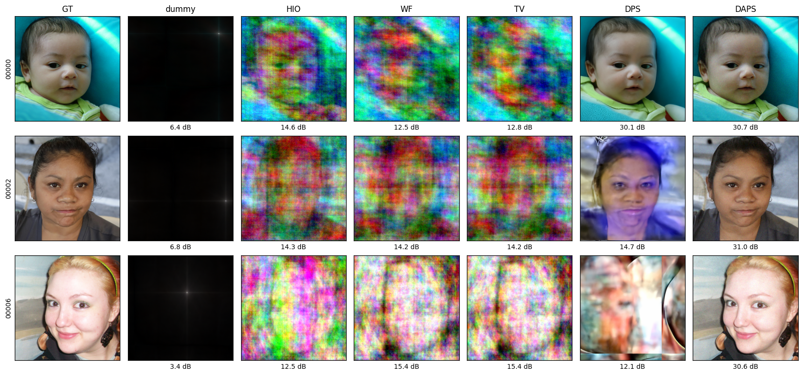

# DPS vs DAPS 리뷰 — Diffusion Prior로 푸는 Phase Retrieval (method·결과 중심)

두 논문을 method와 결과 위주로 리뷰한다. 두 방법 모두 **사전학습 unconditional diffusion model을 그대로 prior로 쓰고, 샘플링 시점에만 measurement를 주입**하는 zero-shot posterior sampling 계열이다 — task별 재학습이 없다. 우리 replication(FFHQ-256 phase retrieval, 공식 체크포인트 `ffhq_10m.pt`)을 검증 증거로 병기한다.

- 리뷰 대상: [DPS] Chung et al., *Diffusion Posterior Sampling for General Noisy Inverse Problems*, ICLR 2023 (arXiv:2209.14687) · [DAPS] Zhang et al., *Improving Diffusion Inverse Problem Solving with Decoupled Noise Annealing*, CVPR 2025 (arXiv:2407.01521)
- 실험 노트: `donggeonbae/research`의 [nonlinear-image-inverse-scaffold 보고서](https://donggeonbae.github.io/research/projects/nonlinear-image-inverse-scaffold/)
- 작성일: 2026-07-03

## 한 문장 요약

DPS는 "노이즈 있는 비선형 inverse problem에도 diffusion prior를 쓸 수 있다"를 처음 일반적으로 보인 표준 베이스라인이고, DAPS는 DPS의 근사 오차(국소 선형화)가 만드는 불안정성을 **noise annealing과 measurement 주입을 분리**해 해결하여 phase retrieval에서 +13 dB를 얻은 현 SOTA 계열이다.

---

## 1. DPS (ICLR 2023)

### 1.1 문제 설정

일반 forward model $y = \mathcal{A}(x_0) + n$ (Gaussian 또는 Poisson $n$)에서 posterior $p(x_0|y)$를 diffusion model로 샘플링하고 싶다. Reverse SDE에는 posterior score가 필요하다:

$$\nabla_{x_t}\log p_t(x_t|y) = \nabla_{x_t}\log p_t(x_t) + \nabla_{x_t}\log p_t(y|x_t)$$

첫 항은 학습된 score network가 주지만, 둘째 항 $p(y|x_t)$는 **intractable**하다 — $y$는 $x_0$에 대해 정의되는데 $x_t$는 노이즈 낀 중간 상태이기 때문($x_0$를 전부 적분해야 함).

### 1.2 Method: Tweedie 기반 likelihood 근사

DPS의 핵심 한 수는 다음 근사다:

$$p(y|x_t) \simeq p(y|\hat{x}_0(x_t)), \qquad \hat{x}_0 = \frac{1}{\sqrt{\bar\alpha(t)}}\left(x_t + (1-\bar\alpha(t))\nabla_{x_t}\log p_t(x_t)\right)$$

즉 $x_t$에서 Tweedie 공식으로 얻는 **posterior mean** $\hat{x}_0$ 하나로 $p(y|x_t)$를 대체한다(적분을 점추정으로). Gaussian noise에서는 매 스텝:

$$\nabla_{x_t}\log p_t(x_t|y) \simeq s_{\theta^*}(x_t,t) - \rho\,\nabla_{x_t}\|y-\mathcal{A}(\hat{x}_0)\|_2^2$$

$\mathcal{A}$가 미분가능하기만 하면 되므로 **비선형 연산자(phase retrieval의 $|F\cdot|$)에 그대로 적용**된다 — 이것이 SVD 기반 DDRM 등 선형 전용 방법과의 결정적 차이. 실무 step size는 $\zeta_i=\zeta'/\|y-\mathcal{A}(\hat{x}_0)\|$로 정규화한다. 1000-step ancestral sampling에 스텝마다 score용 backprop이 붙는다.

### 1.3 결과 (논문)

- 선형 task(FFHQ-256): SR×4 FID 39.35/LPIPS 0.214, box inpainting 33.12/0.168, Gaussian deblur 44.05/0.257 — DDRM·MCG·PnP-ADMM·Score-SDE 전부 상회.
- **Phase retrieval (FFHQ, Table 3)**: DPS FID 55.61/LPIPS 0.399 vs HIO 96.40/0.542, OSS 137.7/0.635, ER 214.1/0.738.
- 단, phase retrieval은 **"4개 샘플 생성 후 최선값 보고"**를 명시한다 — 단일 run이 신뢰 불가능하다는 것을 저자 스스로 인정하는 프로토콜.

### 1.4 우리 replication (동일 체크포인트·설정)

FFHQ val 10장, oversample 2.0, σ=0.05, 4 runs: **run별 평균 9.5~14.9 dB로 요동, best-of-4 18.8 dB** (DAPS 논문이 재보고한 DPS 17.64 dB와 부합). 성공한 샘플은 30 dB, 실패는 12 dB로 갈라진다(아래 그림 2·3행). 실행 시간 ~150 s/장/run (A6000).

### 1.5 평가

- **강점**: 비선형·노이즈 일반화의 첫 실용 해법, 구현 단순(스텝당 gradient 한 번), 이후 모든 후속 연구의 공통 베이스라인.
- **한계 (method에 내재)**: $p(y|x_t)\to p(y|\hat{x}_0)$는 point 근사라서 $t$가 클수록(노이즈 클수록) 오차가 크다. Phase retrieval처럼 posterior가 **multimodal**(180° 회전 모호성 등)한 문제에서는 초기 궤적이 잘못된 mode로 가면 회복 못 함 → run 간 대분산. 저자들의 best-of-4 프로토콜이 그 증상이다.

---

## 2. DAPS (CVPR 2025)

### 2.1 겨냥한 한계

DPS류는 reverse 궤적의 **연속 스텝들이 강하게 결합**되어 있다: $x_{t-1}$은 $x_t$ 근방에 묶이고, measurement gradient는 국소 선형화로만 들어간다. 비선형·multimodal posterior에서는 이 결합이 초기 오류를 끝까지 끌고 간다.

### 2.2 Method: Decoupled noise annealing

DAPS는 스텝 결합을 끊는다. 각 노이즈 레벨 $\sigma_{t_i}$에서 세 단계 루프:

1. **PF-ODE solve**: $x_{t_i}$에서 unconditional probability-flow ODE를 풀어 $\hat{x}_0$ 획득 (measurement 안 봄).
2. **MCMC posterior sampling**: $p(x_0|x_{t_i}, y) \propto p(y|x_0)\,p(x_0|x_{t_i})$에서 Langevin dynamics로 $x_0$ 샘플. $p(x_0|x_{t_i})$는 $\hat{x}_0$ 중심 Gaussian으로 근사, update는 $\nabla\log p(x_0|x_{t_i}) + \nabla\log p(y|x_0)$, 레벨당 100 Langevin steps.
3. **Re-noise**: $x_{t_{i-1}} = x_0 + \sigma_{t_{i-1}}\epsilon$으로 다음 레벨 초기화.

핵심 성질: $x_{t_{i-1}}$이 $x_t$ 궤적에 묶이지 않고 **fresh noise로 재생성**되므로 연속 스텝이 크게 달라질 수 있다 — 그런데도 각 시점의 time-marginal은 노이즈가 줄며 true posterior로 anneal함을 보인다. 잘못된 mode에 빠져도 다음 레벨 re-noise + MCMC가 탈출 기회를 준다. 이것이 multimodal phase retrieval에서 결정적이다. 설정: DAPS-1k(선형: ODE 4 NFE × 250 annealing steps), DAPS-4k(비선형: 10 NFE × 400 steps).

### 2.3 결과 (논문)

| Task (256px) | DAPS | DPS | 기타 |
|---|---|---|---|
| **Phase retrieval, FFHQ** | **30.72 dB** / LPIPS 0.121 | 17.64 / 0.410 | ReSample 21.60, LatentDAPS 29.16, RED-diff 15.60 |
| Phase retrieval, ImageNet | **25.78** / 0.254 | 16.81 / 0.447 | LatentDAPS 20.54 |
| Nonlinear deblur, FFHQ | **28.29** | 23.39 | |
| HDR, FFHQ | **27.12** | 22.73 | |
| SR×4, FFHQ | **29.07** / 0.177 | 24.38 / 0.260 | |

Phase retrieval에서 **+13 dB** — 비선형·multimodal일수록 격차가 크고, 선형 task에서도 일관 우위.

### 2.4 우리 replication

FFHQ val 10장, 동일 조건, DAPS-1k 4 runs: **자체 평가 mean 30.36 dB**(논문 30.72와 일치), 우리 통일 채점(모호성 정합, 같은 noise seed) best-of-4 **30.34 dB**, run별 mean도 25.8~28.6 dB로 안정적. 실행 ~30 s/장/run — DPS의 1/5 시간에 +11 dB. 10장 전부에서 사실상 완전 복원(아래 그림 마지막 열).

*(우리 replication montage — 소스: `nonlinear_image_inverse/scripts/make_method_montage.py`, 데이터 `outputs/metrics/`)*

### 2.5 평가

- **강점**: 근사를 "더 정확한 gradient"가 아니라 **샘플링 구조 변경**으로 해결한 점이 요체. MCMC가 명시적으로 posterior를 탐색하므로 multimodality에 강하고, 실측 재현성이 매우 좋다(우리 재현과 논문 수치 0.4 dB 이내).
- **한계**: 레벨당 100 Langevin steps라 하이퍼파라미터(step size, τ, annealing 스케줄)가 task별 튜닝됨; posterior 근사 $p(x_0|x_t)\approx\mathcal{N}(\hat{x}_0,\cdot)$ 자체는 여전히 단봉 근사(논문도 인정); FFHQ처럼 강한 prior가 있는 도메인에서 최적 — prior가 약한 도메인(자연영상 일반)에선 ImageNet 수치(25.78)가 보여주듯 격차가 줄어든다.

---

## 3. 종합: 우리 프로젝트에의 시사점

1. **벤치마크 정렬**: 두 논문 모두 FFHQ-256(+ImageNet-256), oversample 2.0, σ=0.05 — 우리 평가도 FFHQ-256을 주 벤치마크로 통일했다.
2. **프로토콜 주의**: DPS 계열 수치는 best-of-N 여부를 반드시 명시해야 비교 가능. 우리 통일 채점에서는 mean과 best-of-4를 병기한다.
3. **방법론 교훈**: phase retrieval의 병목은 데이터 항의 정밀도가 아니라 **mode 탐색**이다 — 고전 HIO(random restart)도, DAPS(re-noise + MCMC)도 같은 문제를 다른 수준에서 공격한다. 스캐폴드에 in-repo diffusion prior를 넣을 때 DAPS 구조(decoupled annealing)를 우선 후보로 삼는 근거.

## 4. 메타데이터

| | DPS | DAPS |
|---|---|---|
| 저자/연도 | Chung, Kim, Mccann, Klasky, Ye · 2023 | Zhang, Chu, Song, et al. · 2024(v1)/CVPR 2025 |
| 소스 | arXiv:2209.14687, ICLR 2023 | arXiv:2407.01521, CVPR 2025 |
| 코드 | github.com/DPS2022/diffusion-posterior-sampling | github.com/zhangbingliang2019/DAPS |
| 체크포인트 | ffhq_10m.pt (FFHQ-256 DDPM, 저자 공개 Drive) | 동일 체크포인트 재사용 |
| Replication 아티팩트 | `/home/dgbae/data/baselines/results*`, `nonlinear_image_inverse/outputs/metrics/` | 〃 |
| 접근일 | 2026-07-03 | 2026-07-03 |
